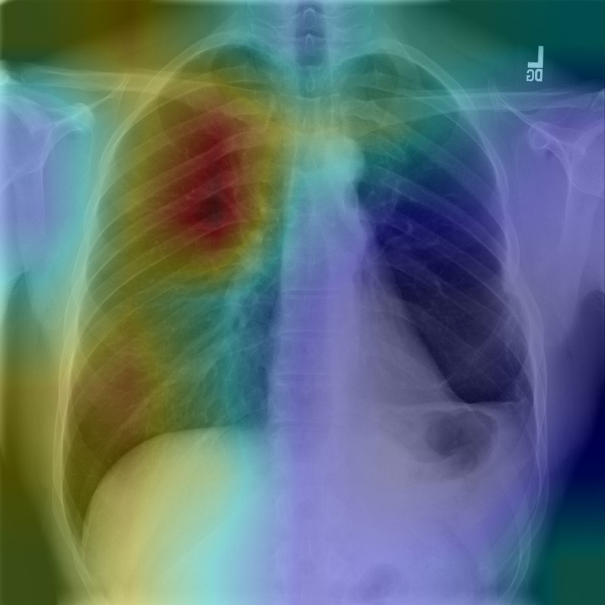

# ChexSeg : Développement d'un modèle d'intelligence artificielle pour l'analyse et le traitement d'examens radiologiques
# Description
Ce projet implémente une application web qui utilise le modèle ChexNet  pour la détection de pathologies pulmonaires à partir d'images radiographiques. Le modèle génère des Grad-CAMs (Class Activation Maps), permettant d'afficher des superpositions d'images avec des zones colorées correspondant aux régions infectées détectées dans les radiographies. Le projet comprend un backend Flask API pour la gestion des requêtes et un frontend React pour l'interface utilisateur, permettant aux utilisateurs de télécharger des images et d'observer les résultats des analyses.

# Prérequis

Backend :
Python 3.11
Pip (gestionnaire de paquets Python)

Frontend :
Node.js et npm (gestionnaire de paquets JavaScript)

# Installation
# 1. Installer les dépendances pour le backend
Dans le dossier chexseg, ouvrez un terminal et exécutez les étapes suivantes :
## 1. Créez un environnement virtuel :
python -m venv venv

## 2. Activez l'environnement virtuel
Sur Windows :
venv\Scripts\activate

## 3. Installez les dépendances Python nécessaires
pip install -r requirements.txt

# 2. Lancer le backend avec Flask API
Dans le dossier chexseg, exécutez le fichier app.py pour démarrer le serveur Flask qui gère les requêtes API :
python app.py
Cela démarre le backend, qui sera disponible à l'adresse http://localhost:5000.

# 3. Installer les dépendances pour le frontend
Dans le dossier frontend, ouvrez un terminal et exécutez la commande suivante :
## 1. Installez les dépendances JavaScript avec npm
cd frontend
npm install

# 4. Lancer l'interface React
Dans le même terminal, lancez l'application React avec la commande suivante :
npm run dev

# Utilisation

Une fois les deux serveurs (backend et frontend) en cours d'exécution, ouvrez votre navigateur et accédez à http://localhost:5173 pour utiliser l'interface.

Téléchargement d'une image :
Accédez à l'interface de l'application sur http://localhost:5173.

Téléchargez une image de radiographie du dossier chexseg/chexseg_data/images.

Le modèle ChexNet-UNet générera des Grad-CAMs pour l'image, superposant les régions infectées détectées sur l'image originale.

# Visualisation des résultats

Une fois le traitement effectué, vous pourrez voir l'image originale avec les zones infectées surlignées par les Grad-CAMs. Ces superpositions montrent visuellement quelles zones de l'image sont liées à des pathologies détectées par le modèle avec les analyses correspondantes .

